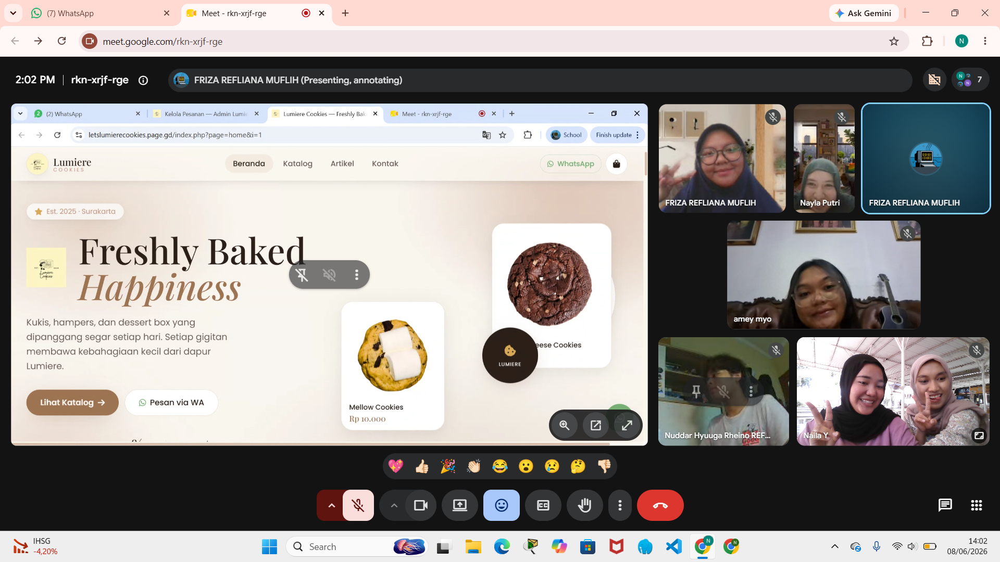
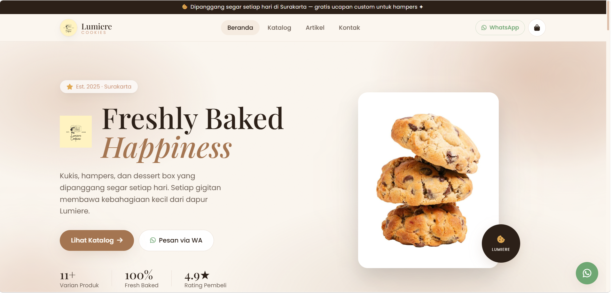
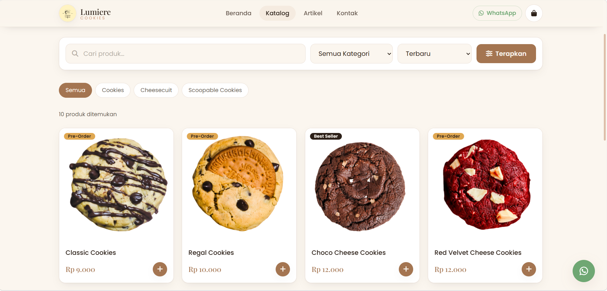
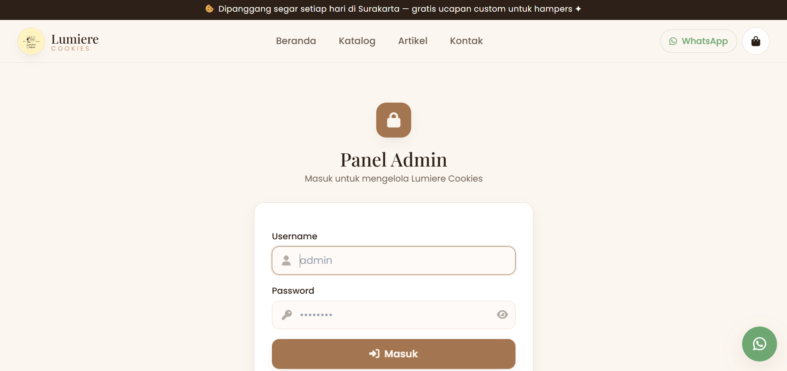

# 🍪 Lumiere Cookies — Website UMKM

> *Freshly Baked Happiness* — Toko kukis, hampers, dan dessert box di Surakarta.

Website company profile sekaligus katalog & pemesanan online untuk UMKM **Lumiere Cookies**, dibuat untuk tugas mata kuliah **Pemrograman Web**. Dibangun dengan **PHP Native + MySQL** (tanpa framework, tanpa ORM) dan **raw SQL via PDO**.

---

## Download Folder ZIP via Gdrive

[Klik di sini untuk mengunduh folder ZIP proyek](https://drive.google.com/drive/folders/1hm-s7HAVaqcObkNsf3vY4WU-jtkOT4t7?usp=sharing)

---

## Meeting Team dengan Owner

Dokumentasi pertemuan tim dengan pemilik UMKM Lumiere Cookies untuk pengumpulan data, kebutuhan fitur, dan validasi desain.

| Tanggal | Peserta | Topik |
|---------|---------|-------|
| — | Tim + Owner | Pengenalan proyek & pengumpulan data UMKM |
| — | Tim + Owner | Review desain & konfirmasi fitur |

!

---

## Hasil Hosting

Website berhasil di-hosting dan dapat diakses secara online melalui tautan berikut:

**URL:** 
[https://letslumierecookies.page.gd/] halaman index
[https://letslumierecookies.page.gd/index.php?page=catalog] halaman catalog







## ✨ Fitur

### Sisi Pengunjung (Publik)
- **Beranda** — hero, profil toko, kategori, best seller, galeri, testimoni, FAQ, dan **peta lokasi (Google Maps embed)** yang bisa diklik.
- **Katalog Produk** — pencarian, filter kategori, sortir (terbaru / harga / nama), dan pagination.
- **Detail Produk** — galeri, deskripsi, stok, qty selector, dan tombol tanya via WhatsApp.
- **Keranjang Belanja** — berbasis session, badge bulat realtime di ikon keranjang, mini-cart drawer, dan halaman keranjang penuh (tambah/kurang/hapus item).
- **Checkout** — form pemesan, metode pengambilan (ambil/kirim/lainnya), perhitungan ongkir, dan pembuatan **invoice** otomatis.
- **Konfirmasi Pesanan** — ringkasan invoice + tombol **kirim pesanan via WhatsApp** (pesan terisi otomatis).
- **Artikel/Blog** — daftar & detail artikel.
- **Kontak** — form pesan (tersimpan ke database), info kontak, peta, dan WhatsApp.

### Sisi Admin (Login Diperlukan)
- **Login aman** — `password_hash()` / `password_verify()`, session, `session_regenerate_id()`, dan proteksi **CSRF** di semua form.
- **Dashboard** — ringkasan produk, pesanan, pendapatan, pelanggan + grafik **Chart.js** (pendapatan 7 hari & status pesanan).
- **CRUD Produk** — tambah/edit/hapus, **upload gambar**, badge, stok, status aktif.
- **CRUD Kategori, Artikel, Galeri, Testimoni, FAQ**.
- **Manajemen Pesanan** — filter status, detail pesanan, ubah status, hubungi pelanggan, dan **export laporan penjualan ke CSV**.
- **Pesan Masuk** — kotak masuk form kontak (tandai dibaca, balas WhatsApp, hapus).
- **Pengaturan** — profil toko, lokasi/peta, tentang, dan kelola nomor WhatsApp.

---

## 🛠️ Teknologi

| Lapisan | Teknologi |
|---|---|
| Bahasa | PHP 8 Native (tanpa framework) |
| Database | MySQL / MariaDB (raw SQL via **PDO**, prepared statements) |
| Frontend | HTML5, Tailwind CSS (CDN), JavaScript |
| Library UI | Font Awesome, AOS, Swiper, SweetAlert2, Chart.js |
| Font | Playfair Display + Poppins |

> Routing memakai query string (`index.php?page=...`) agar bebas dependensi `.htaccess` dan andal di hosting gratis (mis. InfinityFree).

---

## 👥 Anggota Kelompok & Pembagian Tugas

| Anggota | Tanggung Jawab (pembagian merata — 7 berkas/anggota) |
|---|---|
| **Hyuga** | Front controller (`index.php`), header & footer, beranda, daftar artikel, `main.js`, `style.css` |
| **Naila Yoda** | Keranjang (halaman + drawer), checkout, konfirmasi pesanan, API keranjang, `cart.js`, daftar & detail pesanan admin |
| **Friza** | Login & logout, koneksi database & config, fungsi helper bersama, layout header & footer admin |
| **Nayla** | Katalog, detail produk, detail artikel, CRUD produk, CRUD kategori, dashboard, export CSV |
| **Sekar** | Halaman kontak, CRUD testimoni, FAQ, artikel admin, galeri, pesan masuk, pengaturan |

> Setiap anggota mengerjakan jumlah berkas yang sama (7 berkas) agar beban kerja terbagi rata. Atribusi penanggung jawab tercantum sebagai komentar di header setiap berkas.

---

## 📁 Struktur Folder

```
membangun-web-umkm-atau-pcm-lumiere-cookies/
├── database/
│   ├── schema.sql        # Struktur 12 tabel (relasi FK + index)
│   └── seed.sql          # Data contoh (admin, produk, pesanan, dll)
├── public/               # Document root (titik akses web)
│   ├── index.php         # Front controller + routing
│   ├── .htaccess
│   └── assets/           # css, js, images (folder upload)
├── src/
│   ├── config/           # database.php (PDO) & config.php
│   ├── includes/         # header, footer, functions, layout admin
│   └── pages/            # public/, auth/, admin/, api/
├── .env.example          # Contoh konfigurasi
└── README2.md
```

---

## 🚀 Cara Menjalankan (Lokal)

### 1. Siapkan Database
Buat database dan import skema + data contoh:

```bash
mysql -u root -p -e "CREATE DATABASE lumiere_cookies"
mysql -u root -p lumiere_cookies < database/schema.sql
mysql -u root -p lumiere_cookies < database/seed.sql
```

> Catatan: `schema.sql` membuat database `lumiere_cookies` secara otomatis bila dijalankan tanpa memilih database (`mysql -u root -p < database/schema.sql`).

### 2. Konfigurasi `.env`
Salin contoh konfigurasi lalu sesuaikan kredensial database:

```bash
cp .env.example .env
```

Isi `.env`:
```
DB_HOST=127.0.0.1
DB_PORT=3306
DB_NAME=lumiere_cookies
DB_USER=root
DB_PASS=          # isi password MySQL Anda
APP_BASE=         # kosongkan untuk server lokal
```

### 3. Jalankan Server
Gunakan built-in server PHP dengan document root `public/`:

```bash
php -S localhost:8000 -t public
```

Buka **http://localhost:8000** di browser.

> Bisa juga dengan XAMPP/Laragon: letakkan folder di `htdocs`, lalu akses `http://localhost/membangun-web-umkm-atau-pcm-lumiere-cookies/public/` dan set `APP_BASE=/membangun-web-umkm-atau-pcm-lumiere-cookies/public` di `.env`.

### 4. Login Admin
Buka **http://localhost:8000/index.php?page=login**

| Username | Password |
|---|---|
| `admin` | `admin123` |

---

## 🗄️ Skema Database (12 Tabel Berelasi)

`admins`, `categories`, `products` (FK → categories), `orders`, `order_items` (FK → orders & products), `testimonials`, `faqs`, `articles`, `gallery`, `contact_messages`, `settings`, `whatsapp_numbers`.

Relasi utama: `products.category_id → categories.id`, `order_items.order_id → orders.id`, `order_items.product_id → products.id`. Query katalog & laporan memakai **JOIN** antar tabel.

---

## 📝 Catatan

- Seluruh data (produk, pesanan, pengaturan, kontak, dll.) **diambil dari database**, bukan hardcode.
- Folder upload gambar: `public/assets/images/{products,gallery,articles,banners}` (harus dapat ditulis oleh web server).
- Semua form dilindungi token **CSRF**, input dibersihkan dengan prepared statement & `htmlspecialchars()`.

© 2026 Lumiere Cookies · Tugas Pemrograman Web
