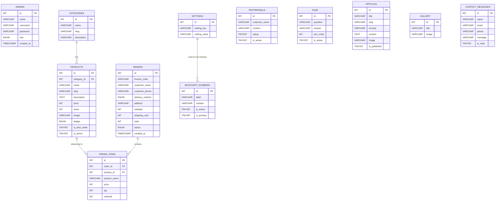

# Architecture & Flow

Ringkasan singkat arsitektur, ER diagram (relasi DB) dan flow untuk panel admin.

## ER Diagram (DB relations)



## Admin actions -> DB (operational flow)

```mermaid
flowchart TD
  Admin[Admin (authenticated)] --> Dashboard[Dashboard]
  Dashboard --> ManageProducts[Manage Products]
  Dashboard --> ManageCategories[Manage Categories]
  Dashboard --> ManageOrders[Manage Orders]
  Dashboard --> ManageContent[Manage Articles / Gallery / Testimonials / FAQs]
  Dashboard --> ManageSettings[Manage Settings & WhatsApp Numbers]
  ManageProducts -->|create/update/delete| PRODUCTS_TABLE[(products)]
  ManageCategories -->|create/update/delete| CATEGORIES_TABLE[(categories)]
  ManageOrders -->|view/update status| ORDERS_TABLE[(orders)]
  ManageOrders -->|view items| ORDER_ITEMS_TABLE[(order_items)]
  ManageContent -->|create/update/delete| ARTICLES_TABLE[(articles)]
  ManageContent -->|manage media| GALLERY_TABLE[(gallery)]
  ManageContent -->|moderate| TESTIMONIALS_TABLE[(testimonials)]
  ManageContent -->|edit FAQ| FAQS_TABLE[(faqs)]
  ManageSettings -->|edit key/value| SETTINGS_TABLE[(settings)]
  ManageSettings -->|manage numbers| WHATSAPP_TABLE[(whatsapp_numbers)]
  Login[Login Page] -->|POST creds| Auth[Authenticate via `admins` table]
  Auth -->|success| Admin
```

## Notes
- `settings` berfungsi sebagai key/value store dan diambil dengan fungsi `setting()`.
- `orders` + `order_items` menyimpan riwayat transaksi; ubah `status` tanpa mengubah items.
- Untuk referensi kode lihat `public/index.php` (routing), `src/includes/functions.php` (helper), dan folder `src/pages/admin`.

---
File ini dibuat otomatis oleh assistant untuk membantu dokumentasi proyek.
